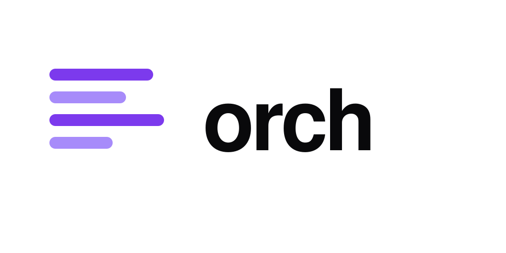

<p align="center">
  
</p>

# orch

**Run AI agents as a team. Show clients a live dashboard — not a Slack thread.**

orch is a local task orchestrator for freelancers and agencies building with AI.
You define the work as a DAG (`tasks.json`), dispatch each task to Claude, Codex,
or Gemini in parallel, and share a read-only dashboard URL with your client so
they see progress in real time.

---

## The problem

Your client is paying for AI tokens they can't see. You're shipping features they
can't track. Status updates live in Slack threads that get lost. orch fixes that.

---

## How it works

```
1. orch atomize --apply   # spec.md → tasks.json → SQLite
2. orch run               # dispatch tasks to AI agents in parallel
3. orch dashboard         # share a URL — client sees live progress
```

---

## Quick start

```bash
pipx install orch
cd my-project
orch init
orch run
orch dashboard --profile stakeholder --tunnel
```

---

## What makes it different

| Feature | LangChain | CrewAI | Devin | **orch** |
|---------|:---------:|:------:|:-----:|:--------:|
| Multi-backend in one DAG | ❌ | ❌ | ❌ | ✅ |
| Budget guardrails per provider | ❌ | ❌ | ❌ | ✅ |
| Client-shareable dashboard | ❌ | ❌ | ❌ | ✅ |
| Spec → tasks pipeline | ❌ | ❌ | ❌ | ✅ |
| Git worktree isolation per task | ❌ | ❌ | ❌ | ✅ |
| PR per task + CI auto-validation | ❌ | ❌ | ✅ | ✅ |
| CI workflow + auto-merge on green | ❌ | ❌ | ✅ | ✅ |
| Sprint velocity + ETA | ❌ | ❌ | ❌ | ✅ |
| Milestones with Gantt timeline | ❌ | ❌ | ❌ | ✅ |
| Executive summary (deterministic) | ❌ | ❌ | ❌ | ✅ |
| Slack / Discord webhooks | ❌ | ❌ | ❌ | ✅ |
| Single config file (`config.yaml`) | ❌ | ❌ | ❌ | ✅ |
| Browser tool use / long-horizon | ❌ | ❌ | ✅ | ❌ |
| IDE built-in | ❌ | ❌ | ✅ | ❌ |

---

## Configuration

One file. `orch init` writes it for you:

```yaml
# .orchestrator/config.yaml
concurrency:
  global_max: 4
  per_provider:
    claude: 2
    gemini: 2

dashboard:
  kanban:
    refresh_interval_s: 10
  tunnel:
    enabled: false        # flip to share a URL with your client

github:
  test_command: pytest    # CI workflow orch generates for you
  auto_merge: false       # opt-in; requires branch protection

notifications:
  slack_webhook: ""       # optional: get pinged on task blocks / CI failures
```

Optional overrides drop in as their own files at the project root: `budgets.yaml` (spend guardrails), `model_router.yaml` (routing table — `orch router add-missing` populates it on demand).

---

## What your client sees

`orch dashboard --profile stakeholder --tunnel` publishes a read-only URL. Send it once; the numbers update themselves. The client gets:

- **Milestones with a Gantt-like timeline** and an ETA per milestone (velocity-based, badge-colored by confidence).
- **Executive summary** in plain business language, refreshed on every page load (`"Project 62% complete — 5 of 8 tasks delivered. 1 blocked. ETA 3 Sep. AI spend: $12."`).
- **Blockers view** — which tasks are stuck, since when, with the reason next to each one.
- **Budget vs actual** — tokens burned per provider vs the guardrail, USD on the side.

> _Live screenshots and a 30-second GIF (`orch init` → dispatch → PR merged → stakeholder ETA update) are pending — captured after the next release cut. See [`docs/DELIVERING-TO-STAKEHOLDERS.md`](docs/DELIVERING-TO-STAKEHOLDERS.md) for the walk-through._

---

## Roadmap

**v0.8.x (shipped)** — Serie F+G+H-2/H-3: worktrees, PR + CI auto, auto_merge, sprint health, milestones, Gantt, exec summary, budget chart, Slack/Discord webhooks, `orch notify digest`, config consolidation, brand.

**v1.0 (in flight)** — H-1: guided `orch init` wizard + 5 canonical templates (`python-api`, `nextjs-saas`, `chatbot-whatsapp`, `expo-mobile`, `data-pipeline`).

**Post-1.0** — DAG visual editor, PDF export of the sprint/milestone digest, VS Code / Cursor extension, `orch dashboard --portfolio` for agencies with several clients, per-project client auth tokens.

`orch` is dogfooded — we plan and dispatch orch's own sprints through orch. Every PR you see on this repo was orchestrated by the version that opened it.

---

## Documentation

- [English manual](docs/MANUAL.en.md)
- [Manual en español](docs/MANUAL.es.md)
- [Dashboard / stakeholder guide](docs/DELIVERING-TO-STAKEHOLDERS.md)
- [Developer notes](docs/README-dev.md)
- [Roadmap (living doc)](docs/brainstorm/next-sprints.md)
