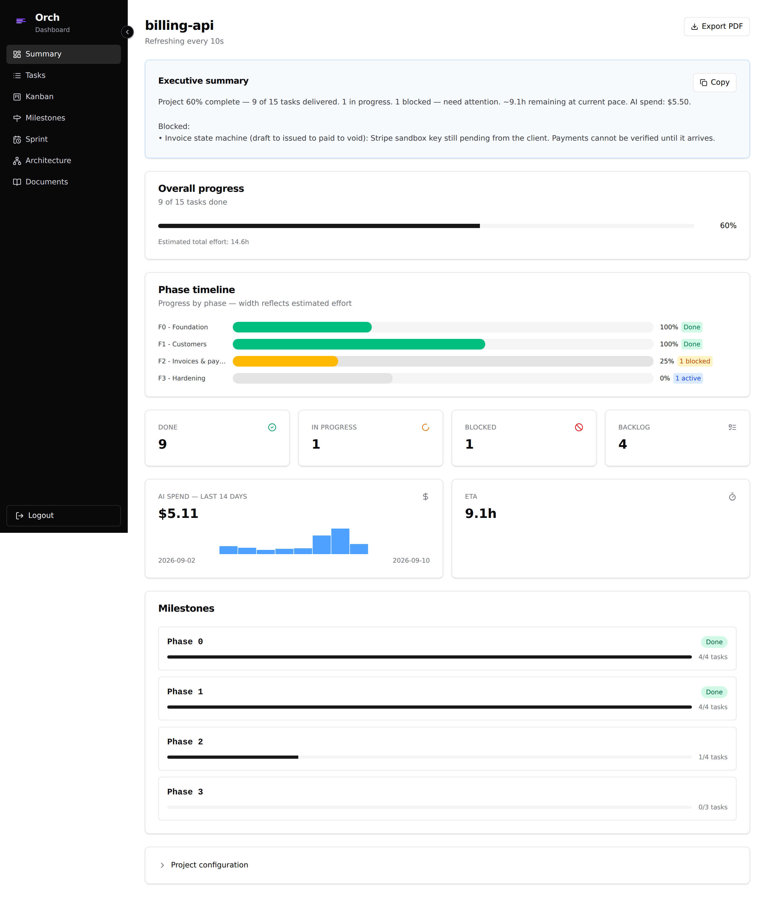

<p align="center">
  
</p>

# orch

**Run AI agents as a team. Show clients a live dashboard — not a Slack thread.**

orch is a local task orchestrator for freelancers and agencies building with AI.
You define the work as a DAG (`tasks.json`), dispatch each task to Claude, Codex,
or Gemini in parallel, and share a read-only dashboard URL with your client so
they see progress in real time.

---

## The problem

Your client is paying for AI tokens they can't see. You're shipping features they
can't track. Status updates live in Slack threads that get lost. orch fixes that.

---

## How it works

```
1. orch atomize --apply   # spec.md → tasks.json → SQLite
2. orch run               # dispatch tasks to AI agents in parallel
3. orch dashboard         # share a URL — client sees live progress
```

---

## Quick start

```bash
curl -fsSL https://raw.githubusercontent.com/hectorcanaimero/orch/main/scripts/install.sh | sh
cd my-project
orch init
orch run
orch dashboard --tunnel   # with `tunnel: enabled: true`: prints a link for your client
```

`orch` is a single Go binary — no Python, no venv, no `pip`. See
[Install](#install) below for Homebrew and manual-download alternatives,
and the [manual](docs/MANUAL.en.md) for the full walkthrough.

---

## Install

**Script** (Linux/macOS, `amd64`/`arm64`):

```bash
curl -fsSL https://raw.githubusercontent.com/hectorcanaimero/orch/main/scripts/install.sh | sh
```

Downloads the matching tarball from the latest GitHub Release, verifies
its checksum, and installs to `~/.local/bin` (`INSTALL_DIR=...` to
override).

**Homebrew** (once the tap is published — see `docs/RELEASING.md`):

```bash
brew install hectorcanaimero/orch/orch
```

**Manual**: grab a tarball from the
[Releases page](https://github.com/hectorcanaimero/orch/releases) and put
`orch` on your `PATH` yourself.

Verify either way with `orch --version`. See
[`docs/RELEASING.md`](docs/RELEASING.md) for the tag scheme and how
releases are built, and [`docs/MANUAL.en.md`](docs/MANUAL.en.md) for the
full CLI walkthrough.

---

## What makes it different

orch isn't competing with LangChain or Devin — it's one of several small,
open-source boards for running CLI coding agents (Claude Code, Codex,
OpenCode…) in parallel. Here's an honest comparison against the projects
builders in that space actually reach for today.

| | [Multica](https://github.com/multica-ai/multica) | [Vibe Kanban](https://github.com/BloopAI/vibe-kanban) | [Agetor](https://github.com/alamops/agetor) | [Claude Squad](https://github.com/smtg-ai/claude-squad) | **orch** |
|---|:---:|:---:|:---:|:---:|:---:|
| GitHub stars | 49.6k | 28.1k | 65 | 8.5k | **1** |
| Stack | Go + Next.js + Postgres | Rust | TypeScript (Electrobun) | Go | Go |
| License | Apache-2.0 + commercial | Apache-2.0 | MIT | AGPL-3.0 | MIT |
| CLIs/agents supported | 26 | 10+ | 5 | ~6 | 1 🚧 (claude; codex/opencode/gemini/agy mid-port) |
| Desktop app | ✅ Electron | ❌ | ✅ macOS | ❌ (TUI) | ❌ |
| Mobile app | ✅ iOS | ❌ | ❌ | ❌ | ❌ |
| Cloud-hosted option | ✅ multica.ai | ❌ (shut down w/ Bloop) | ❌ | ❌ | ❌ |
| Single binary | ❌ | ❌ | ❌ | ✅ | ✅ |
| Read-only stakeholder view | ❌ | ❌ | ❌ | ❌ | ✅ |
| Per-provider budget guardrail (blocks dispatch) | ❌ | ❌ | ❌ | ❌ | ✅ |
| Spec → tasks pipeline | ❌ | ❌ | ❌ | ❌ | ✅ |
| Deterministic executive summary | ❌ | ❌ | ❌ | ❌ | ✅ |
| Static export | ❌ | ❌ | ❌ | ❌ | 🚧 in progress |

*Vibe Kanban: Bloop shut down in April 2026 and handed the project to the
community as Apache-2.0; cloud features were switched off, local/self-host
use continues. Star counts and feature notes are current as of this
writing — verify before citing them elsewhere, these projects move fast.*

---

## Configuration

One file. `orch init` writes it for you:

```yaml
# .orchestrator/config.yaml
concurrency:
  global_max: 4
  per_provider:
    claude: 2
    gemini: 2

state:
  backend: sqlite         # default; `file` is legacy JSONL

dispatch:
  worktree_mode: true     # default; each task runs in its own git worktree

vcs:
  auto_pr: true           # default; one PR per finished task

dashboard:
  kanban:
    refresh_interval_s: 10

tunnel:
  enabled: false          # flip to share a link with your client (Cloudflare quick tunnel)

github:
  test_command: pytest    # CI workflow orch generates for you
  auto_merge: false       # opt-in; requires branch protection

notifications:
  slack_webhook: ""       # optional: get pinged on task blocks / CI failures
```

Optional overrides drop in as their own files at the project root: `budgets.yaml` (spend guardrails), `model_router.yaml` (routing table — `orch router add-missing` populates it on demand).

---

## What your client sees

With `tunnel: enabled: true` in `config.yaml`, `orch dashboard --tunnel` (or
the **Start** button on the dashboard's Tunnel page) opens a Cloudflare quick
tunnel — no Cloudflare account needed, just `cloudflared`, whose install steps
the page shows — and gives you a client-portal link with a token in it. Send
it; the numbers update themselves, and stopping the tunnel revokes the link.
The client gets:



- **Executive summary** in plain business language, recomputed on every page load — no LLM call, so it is free and always says the same thing twice.
- **Phase timeline** — progress per phase, bar width proportional to estimated effort, with the blocked phase called out.
- **Blockers with the reason attached**, quoted straight into the summary: _"Stripe sandbox key still pending from the client."_
- **ETA and AI spend** — hours remaining at the current measured pace, and what the run has cost so far.

The client never sees a log line, a prompt, a diff, or a per-model cost breakdown. Flip `dashboard.show_spend_to_stakeholder` if you want them to see spend at all.

> _GIF: not recorded yet. The shot list is written and reproducible — see [`docs/media/GIF-SCRIPT.md`](docs/media/GIF-SCRIPT.md). Walk-through in [`docs/DELIVERING-TO-STAKEHOLDERS.md`](docs/DELIVERING-TO-STAKEHOLDERS.md)._

---

## Roadmap

**v0.8.x (shipped)** — Serie F+G+H-2/H-3: worktrees, PR + CI auto, auto_merge, sprint health, milestones, Gantt, exec summary, budget chart, Slack/Discord webhooks, `orch notify digest`, config consolidation, brand.

**v1.0 (in flight)** — H-1: guided `orch init` wizard + 5 canonical templates (`python-api`, `nextjs-saas`, `chatbot-whatsapp`, `expo-mobile`, `data-pipeline`).

**Post-1.0** — DAG visual editor, PDF export of the sprint/milestone digest, VS Code / Cursor extension, `orch dashboard --portfolio` for agencies with several clients, per-project client auth tokens.

`orch` is dogfooded — we plan and dispatch orch's own sprints through orch. Every PR you see on this repo was orchestrated by the version that opened it.

---

## Documentation

- [English manual](docs/MANUAL.en.md)
- [Manual en español](docs/MANUAL.es.md)
- [Manual em português](docs/MANUAL.pt.md)
- [CLI reference (flags, parity with Python)](docs/CLI.md)
- [Dashboard / stakeholder guide](docs/DELIVERING-TO-STAKEHOLDERS.md)
- [Release process / tag scheme](docs/RELEASING.md)
- [Developer notes](docs/README-dev.md)
- [Roadmap (living doc)](docs/brainstorm/next-sprints.md)

---

## Python legacy

`orch` was originally a Python CLI + FastAPI dashboard; it's being
rewritten as a single Go binary (this README, and everything above,
describes the Go version). The last Python release is frozen on the
`python-legacy` branch, tagged **`v0.11.0-py`** — no new features land on
that line, only the Go binary moves forward.

```bash
pipx install git+https://github.com/hectorcanaimero/orch.git@v0.11.0-py
```

Its own manual is preserved at that tag. See
[`docs/RELEASING.md`](docs/RELEASING.md) for why the two lines share one
tag namespace, split by a `-py` suffix.
